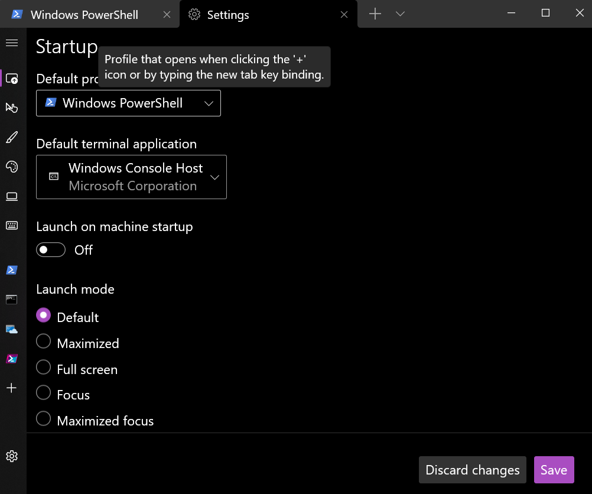

# Addendum: Powershell for Data Science
In this section you will find some tips for using Powershell for Data Science tasks. Powershell is both scripting and command-line shell which offers powerful commands for performing data conversions, sorting and processing.

## What Are the Advantages?
You can process data from various sources in the terminal console. You can run several processes simultaneously in separate, tabbed or splitted terminal windows.
### Pipelines
With pipeline operator **|** you combine commands into command pipeline.

```
Get-ChildItem -Path *.* | Format-Table -Property name, length
```
The commands are executed linearly from left to right, output is shown in terminal and can be saved to a file. Try to execute the pipeline in Quake console <kbd>Win</kbd>+<kbd>\`</kbd>.

### Cmdlets
Cmdlets are prepared functions you can simply call. You can pipe cmdlets with the same noun.
:::note
For help on a command use `Get-Help "cmdlet name"`, to download help files use `Update-Help`.
:::
## Powershell Tools for Data Processing
- Powershell works with CSV, JSON and XML formats
### Development Versions and Installation

On W11, you have already installed Windows Terminal and Powershell 5.1 (older stable), which can be run by command `powershell`. It is residing in **$env:Windows\System32\WindowsPowerShell**. You can check Powershell version by command `$PSVersionTable`.

You  can install development version into **$env:ProgramFiles\PowerShell\7**:

```bash
winget install --id microsoft.powershell.preview
```
You can run this version with `pwsh-preview` command from any terminal.


You can switch shell environments by shortcuts or dropdown menu. In **Settings**, you can change the default behavior, colors, font, background image, and acrylic effects.


You can split Terminal window vertically with <kbd>Alt</kbd>+<kbd>Shift</kbd>+<kbd>+</kbd> and horizontally with <kbd>Alt</kbd>+<kbd>Shift</kbd>+<kbd>-</kbd>.

You can run additional Quake style top terminal with <kbd>Win</kbd>+<kbd>\`</kbd>


### Basic Commands
- `schcm` Show-Command to show commands
- Systeminfo
- Get-WmiObject Win32_VideoController | Select description,driverversion

### Cmdlets
- ConvertTo-JSON
- ConvertFrom-JSON

JSON format: `
{
“IP_comp”: “160.108.0.5”,
“Age”: 26,
“Name”: “Alice”
}
`

CSV format: `
{
IP_comp, Age, Name
“160.108.0.5”, 26 , Alice
}
`
- remove duplicate records
- sort data
- find and replace
- processing more files at once

```
Get-Content "C:\Temp\data.txt" | Sort-Object -Unique | Out-File "C:\Temp\dataout.txt"
```
```
Format-Table Count,Name -AutoSize
```

- What is PSCustomObject?

### Powershell ISE
### Using  Powershell in Examples
- ConvertTo-Csv
- Format-Table ft
- data conversion




```bash
pip install neuralprophet
```

```bash
pip install neuralprophet[live]
```

- test data

:::note
Goals.
:::
:::info
Goals.
:::
:::caution
Goals.
:::
:::warning
Goals.
:::

import Tabs from '@theme/Tabs';

import TabItem from '@theme/TabItem';

:::tip Use tabs in admonitions

<Tabs
  defaultValue="apple"
  values={[
    {label: 'Apple', value: 'apple'},
    {label: 'Orange', value: 'orange'},
    {label: 'Banana', value: 'banana'},
  ]}>
  <TabItem value="apple">This is an apple 🍎

  ```bash
  npm run build
  ```
  </TabItem>
  <TabItem value="orange">This is an orange 🍊</TabItem>
  <TabItem value="banana">This is a banana 🍌</TabItem>
</Tabs>

:::

```md title="docs/hello.md"
# Hello

This is my **first Docusaurus document**!
```

```bash
# Hello

This is my **first Docusaurus document**!
```

<details><summary>CLICK ME</summary>
<p>

#### yes, even hidden code blocks!
chaptertest

```python
print("hello world!")
```

</p>
</details>

Em Dash (—) En Dash (–)
<kbd>Ctrl</kbd>+<kbd>Alt</kbd>+<kbd>0</kbd>

**Soubor ‣ Nový ‣ Obecné**. (*File ‣ New ‣ General*)
