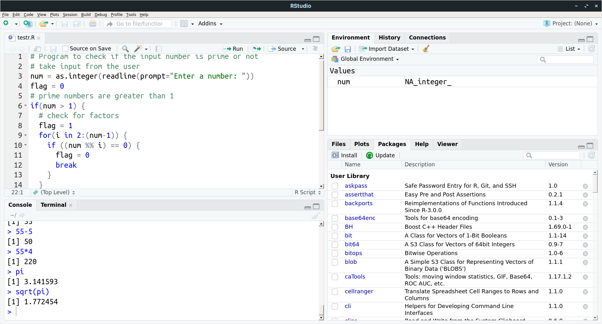

# R Primer
Basics of R. Programming with statistical analysis.
- using R Studio
- using Jupyter
- data processing
## RStudio Installation



You may install RStudio from Anaconda Navigator. You need to create a new enviroment for it (you will also get the option during the installation into root environment).

## R Notebooks


RStudio can work with **R Markdown Notebooks**. Notebooks join text and code to create formatted interactive presentation, able to work even with streaming data.

## R Commands

## R Usage

## Sorting Data with R

## Using R with Jupyter

:::note
Goals.
:::
:::info
Goals.
:::
:::caution
Goals.
:::
:::warning
Goals.
:::

import Tabs from '@theme/Tabs';

import TabItem from '@theme/TabItem';

:::tip Use tabs in admonitions

<Tabs
  defaultValue="apple"
  values={[
    {label: 'Apple', value: 'apple'},
    {label: 'Orange', value: 'orange'},
    {label: 'Banana', value: 'banana'},
  ]}>
  <TabItem value="apple">This is an apple 🍎

  ```bash
  npm run build
  ```
  </TabItem>
  <TabItem value="orange">This is an orange 🍊</TabItem>
  <TabItem value="banana">This is a banana 🍌</TabItem>
</Tabs>

:::

```md title="docs/hello.md"
# Hello

This is my **first Docusaurus document**!
```

```bash
# Hello

This is my **first Docusaurus document**!
```

<details><summary>CLICK ME</summary>
<p>

#### yes, even hidden code blocks!
chaptertest

```python
print("hello world!")
```

</p>
</details>

Em Dash (—) En Dash (–)
<kbd>Ctrl</kbd>+<kbd>Alt</kbd>+<kbd>0</kbd>

**Soubor ‣ Nový ‣ Obecné**. (*File ‣ New ‣ General*)
